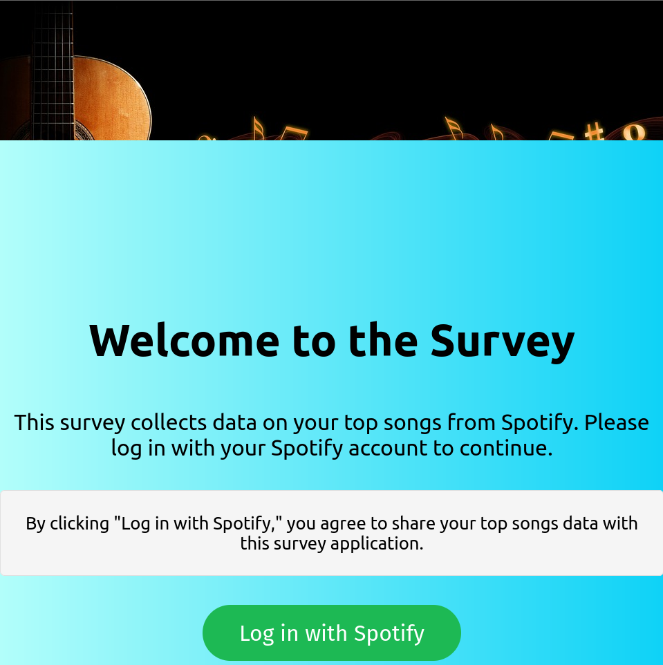
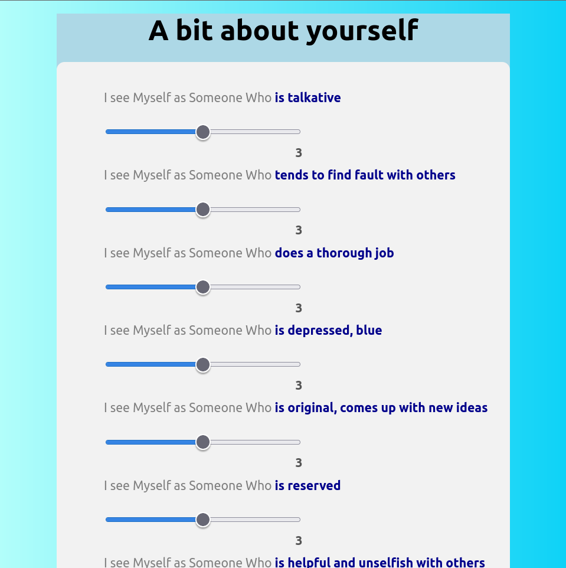
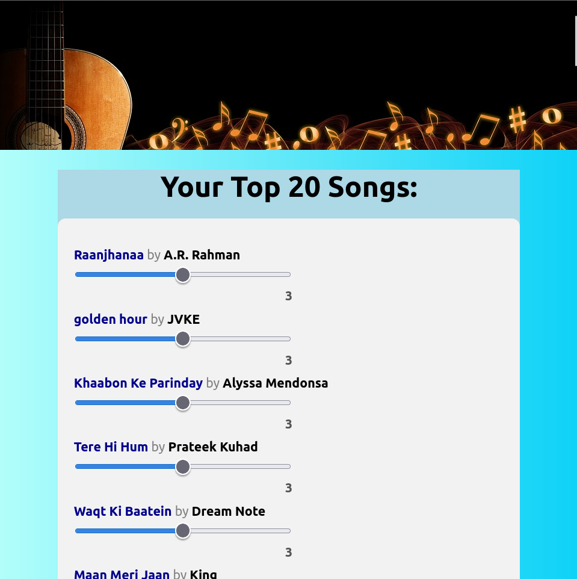
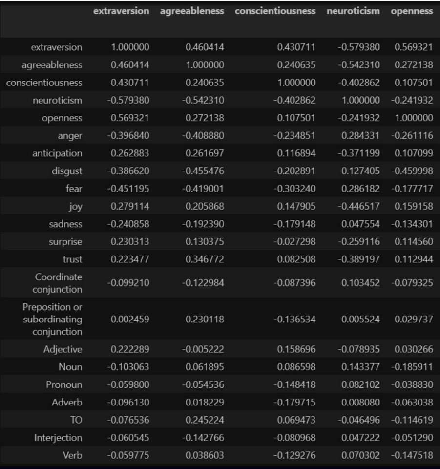

# Association of Personality Traits with Song Lyrics

## Project Report

Team: musicMusic - Keyur Chaudhari(2020101100), Sambasai Reddy(2020101014), Srikar Desu(2020101003)

### Project Aim/Objectives and Background

**Aim:** This study aims to look at the relationship between linguistic clues in people's favorite songs and their personality characteristics. The study tries to illustrate if lyrics have an impact separate from melodic qualities in order to advance and improve theories of musical preferences.

A few questions to be answered are as follows:

1. Is there a structure to music tastes that reflects underlying psychological aspects?
2. Are individual music preferences directly connected to the personality of the person?

Many studies have used a collection of songs as the basis for their study, asking participants to assess their feelings towards the lyrics and the emotions they connect them to.

To mitigate the impact of recall bias, a recent study conducted in China adopted a novel approach to gathering participants' favorite songs. Instead of relying on participants' memory, the study utilized the online music player that they used the most frequently, resulting in a more reliable and effective method of collecting music-related data. Our research aimed to address recall bias by directly collecting data from users' Spotify accounts. To analyze the lyrics, they employed a simplified Chinese version of LIWC, which grouped words into different categories. However, we have since implemented a more robust approach by combining NLTK and NRC (Emolex) to analyze the text.

### Data Collection

1. We conducted a pilot study with a small group.
2. To collect data for our project, we created a Google Form that asked participants for demographic information (age, gender, etc) and their responses to the Big Five personality test consisting of 44 questions. We also asked participants to list their 20 favorite songs.
3. After receiving feedback from some participants, we realized that the form was too long and asking for 20 songs was cumbersome. Additionally, we recognized that there could be a recall bias and that participants may not be able to accurately recall their top songs.

Based on the feedback we received from the pilot study, we decided to pivot our data collection method to a website.

Our website is designed to authenticate users through Spotify, and then automatically retrieve their 20 most-listened-to songs (split 15-5 between short-term and long-term favorites).

Instead of asking users to manually list their favorite songs, the website automatically generates a list based on their Spotify listening history, which should eliminate recall bias.

### Methodology

1. We leveraged the Genius API to extract lyrics from songs based on their titles.
2. Upon compiling the data, we identified a mix of Hindi and English songs, prompting us to translate the former into English for further analysis.
3. Python's Translate Package facilitated the translation process.
4. Thereafter, we utilized the NRC and NLTK tools to obtain frequency counts for the primary emotions and other word categories for the original songs.
5. Using the responses from our form, we calculated individual scores for the big 5 personality traits, as well as frequency counts for the basic emotions and word categories across all 20 songs.
6. Subsequently, we drew correlations between these scores and established a relationship between the emotions and the Big 5 personality traits.

### Results

1. Our research indicated that individuals who preferred to listen to upbeat music, or music that contained surprising or anticipatory elements, tended to exhibit extroverted personality traits.

2. It has been noticed that individuals who score high on agreeableness tend to gravitate towards music that emphasizes the importance of trust.

3. Similarly, those who exhibit high levels of extraversion and conscientiousness have a preference for songs that employ an abundance of descriptive adjectives.

4. It was discovered that songs with assertive and opinionated themes were linked to higher levels of agreeableness, but lower levels of conscientiousness.

5. Individuals who regularly listened to music featuring fearful or angry elements were observed to possess a greater inclination towards neuroticism.

6.  Those who displayed a high degree of openness tended to prefer upbeat and positive music, while those who were averse to music with a disgust-based theme demonstrated a lower level of openness.

The results were analyzed from the correlation matrix that we got from the responses. 

### Visualisations

A bar graph of the frequency of the emotions related to words in the extracted lyrics of all the songs.

Word cloud of all the songs extracted

Box plot for the 8 emotions

Correlation matrix heat map

